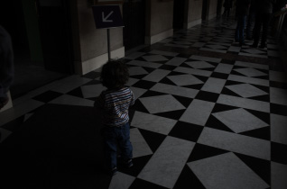
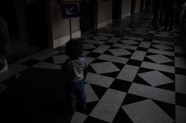
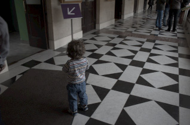

### Deep Demosaick

- Original code: https://github.com/cig-skoltech/deep_demosaick

***
### Example of the result

- MSR dataset / Canon (w/o noise)

|            | Original                   | Demosaicked              |
|------------|:--------------------------:|:------------------------:|
| Linear RGB |  |   |
| sRGB       |    |     |